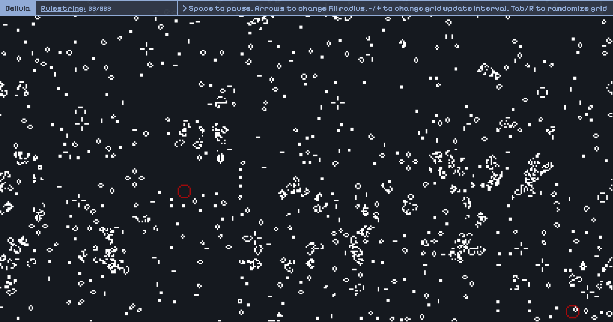

# Cellula

An online cellular automata playground for lifelike cellular automata. Built with pure HTML, CSS and JS, with hardware acceleration using GPU.js. Visit the website [here](https://niyaz-mohamed.github.io/Cellula/).

Lifelike cellular automata can be defined by rulestrings. For [Conway's Game of Life](https://en.wikipedia.org/wiki/Conway%27s_Game_of_Life), since birth of a cell occurs when it has 2 neighbors and survival of a live cell occurs when it has 2 or 3 neighbors, the rulestring is B3/S23. Cellula allows for experimentation of [different rulestrings](https://conwaylife.com/wiki/List_of_Life-like_rules).

## Usage

Usage of the website is simple and instructions are provided in the console at the top left. A short list of key inputs are listed below:

`ARROWUP`/`ARROWDOWN`: Set fill radius\
`p`/`SPACE`: Pause the simulation\
`+`/`-`: Increment or decrement the minimum time between grid updates by 50ms\
`r`/`TAB`: Randomize the grid

## Future Development

I intend to develop this project further in the future by implementing [neural cellular automata](https://www.youtube.com/watch?v=3H79ZcBuw4M&list=WL&index=1) (Credit to Emergent Garden) and [multiple neighborhood cellular automata](https://slackermanz.com/understanding-multiple-neighborhood-cellular-automata/) (Credit to Slackermanz), which tend to display more complex behaviors and tend to form stable solitons.

Other simple automata like elemntary automata and Langton's ant may also be added, if I have the time.
