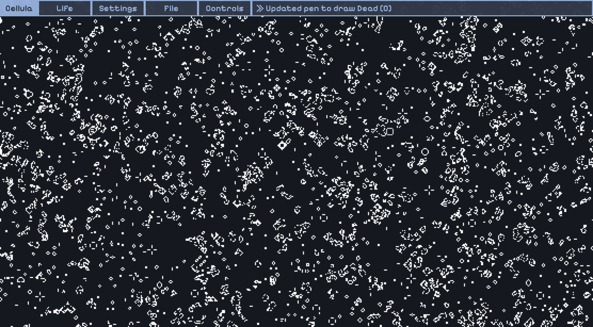

# Cellula

> [Online cellular automata playground](https://niyaz-mohamed.github.io/Cellula) with hardware acceleration using GPU.js, for both PC and mobile

> [!WARNING]
> **Some patterns may strain the eyes or cause seizure. Use with care.**

Perhaps the most famous Cellular Automaton is [Conway's Game of Life](https://en.wikipedia.org/wiki/Conway%27s_Game_of_Life), consisting of a grid of black (dead) and white (live) cells. Birth of a cell occurs when it has 2 neighbors and survival of a live cell occurs when it has 2 or 3 neighbors, meaning the rulestring for this automata B3/S23. Cellula allows for experimentation of [different rulestrings](https://conwaylife.com/wiki/List_of_Life-like_rules) to create automata with unique behavior.

Other, more complex automata like Brian's Brain, Rock Paper Scissors, and Neural Automata are also available, with more detailed explanations on the website. Each of these automata have customization options as well, which you can play around with to generate some very complex behavior!

## 🛠️ Usage

8 different automata are currently available. Each automata has settings which can be changed in the 'Settings' panel. Multiple utility actions (pausing, stepping, randomizing) are all available under the 'Controls' panel, with most utilities having an associated keyboard shortcut.

> [!TIP]
> **Resolving performance issues:** If FPS is low, attempt to enable hardware acceleration for your browser. If this is not possible, then reduce grid resolution/zoom in by pressing 'E', or make your window smaller/use mobile. You should minimally have ~30 FPS when you startup the webapp.

The settings for some of the automata give you almost infinite flexibility to come up with unique patterns. Here are some of the settings provided:

### Lifelike automata

- **Neighborhood**: Determines the neighbors each cell considers when deciding its next state
- **Rulestring**: Determines the number of neighbors required for birth/survival of a cell

> Even with a normal moore neighborhood, you can get very interesting patterns. A favourite of mine is B1/S12345678.

### Elementary CA

- **Wolfram Code**: Number between 0 and 255 encoding the rules of a 1D cellular automaton

> Nothing much to say here. Most of the interesting patterns for this can be found on wikipedia.

### Brian's Brain

- **Neighborhood**: Determines the neighbors each cell considers when deciding its next state
- **Rulestring**: Determines the number of neighbors required for birth of a cell (live cells always convert in the next generation)

> Asymmetric neighborhoods for this automata tend to produce very neat looking spaceships. Try having only the cell above the current cell as a neighbor, with rulestring 1.

### Rock Paper Scissors

- **Number of States**: How many states to use from Rock, Paper, Scissors, Lizard, and Spock
- **Neighborhood**: Determines the neighbors each cell plays rock paper scissors against
- **Rulestring**: The number of neighbors a cell must be beaten by to be converted

> Forms stable spiral patterns. It's quite interesting to pause this automata and switch to WireWorld/Brian's Brain, it makes some very uniquely colored spirals!

### Neural Automata

- **Presets**: Too lazy to come up with your own automata? I've compiled some interesting ones for you
- **Cell Weights**: Determines the weight each neighboring cell is given during the convolution step
- **Skip Frames**: Some patterns are strobing and look much smoother if you skip frames, but this does reduce simulation speed
- **Activation Function**: Plug in any JavaScript function of your choice (as long as GPU.js supports it) to control the activation step
  
> Activation functions are immensely powerful, allowing you to run even the game of life with this CA. While I have not tested it yet, it might be possible to implement [multiple neighborhood cellular automata](https://slackermanz.com/understanding-multiple-neighborhood-cellular-automata/) if weights are carefully chosen. Mess around and see what you can make!

### Huegene

- **Random Factor**: The maximum possible extent by which hue can change between 2 cells
- **Fade**: Determines whether cells should fade away (NOTE: This isn't a perfect implementation and might need to be changed)
- **Psychedelic**: Trippy colors making a weird kaleidoscopic effect
  
> I came across psychedelic mode completely by accident during development and thought it looked cool, so I added it in as a feature!

## 🚀 Future Development

I've implmented most of the CA I'm interested in, but there are still a few [continuous CA in this video](https://www.youtube.com/watch?v=kzwT3wQWAHE&t=217s) that seem interesting (Credit to Sabastian Lague).

## 🖼️ Gallery

|         |  |
| ----------------------------------------------------------------------------------------------------- | ----------------------------------------------------------------------------------------------------- |
|       |   |
|     |             |
|  |           |
