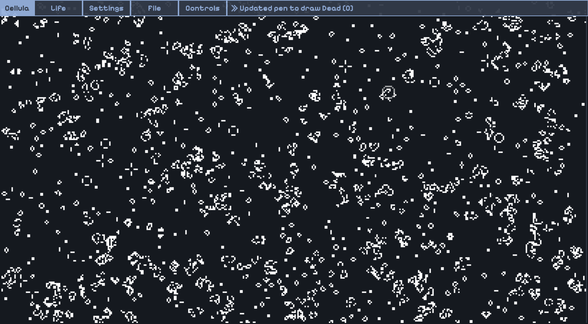
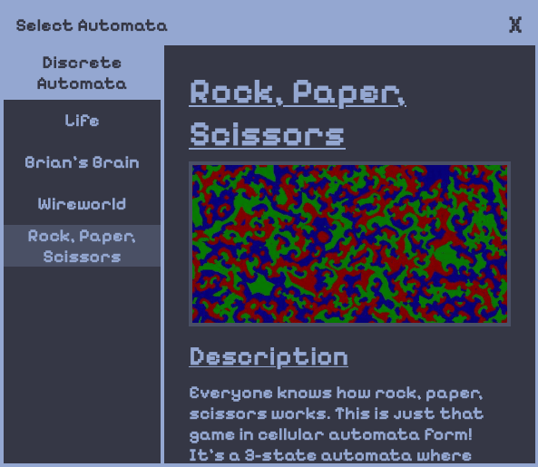
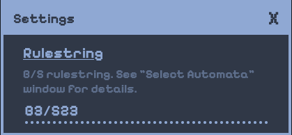

# Cellula

An online cellular automata playground for lifelike cellular automata. Built with pure HTML, CSS and JS, with hardware acceleration using GPU.js. Visit the website [here](https://niyaz-mohamed.github.io/Cellula/).

Lifelike cellular automata can be defined by rulestrings. For [Conway's Game of Life](https://en.wikipedia.org/wiki/Conway%27s_Game_of_Life), since birth of a cell occurs when it has 2 neighbors and survival of a live cell occurs when it has 2 or 3 neighbors, the rulestring is B3/S23. Cellula allows for experimentation of [different rulestrings](https://conwaylife.com/wiki/List_of_Life-like_rules). Other, more complex automata like Brian's Brain, Wireworld, and Rock Paper Scissors are also available, with more detailed explanations on the website.

<mark>**SEIZURE WARNING: SOME PATTERNS ARE STROBING AND MAY HURT YOUR EYES**</mark>

## Usage

Usage of the website is simple and instructions are provided in the console at the top right. Different automata automata can be selected in the automata seelction panel, opened by clicking the "Life" button in the top left. Settings for each automata can be changed in the "Settings" panel. A list of controls and their shortcuts are available in the "Controls" dropdown.

| Selection Window                       | Settings Window                         |
| -------------------------------------- | --------------------------------------- |
|  |  |

## Future Development

I intend to develop this project further in the future by implementing [neural cellular automata](https://www.youtube.com/watch?v=3H79ZcBuw4M&list=WL&index=1) (Credit to Emergent Garden) and [multiple neighborhood cellular automata](https://slackermanz.com/understanding-multiple-neighborhood-cellular-automata/) (Credit to Slackermanz), which tend to display more complex behaviors and tend to form stable solitons. Other simple automata like elementary automata and Langton's ant may also be added.

## Gallery

|    |  |
| ---------------------------------- | --------------------------------------- |
|  |   |
